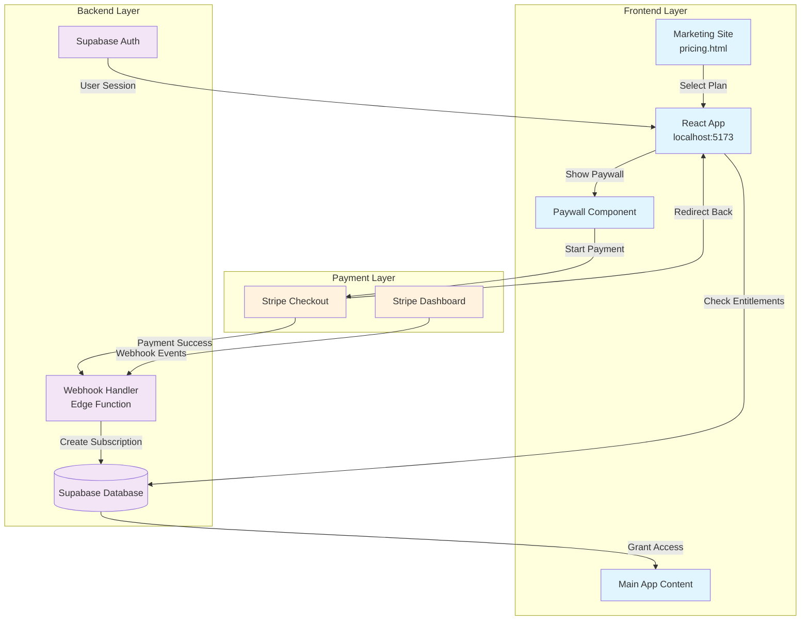
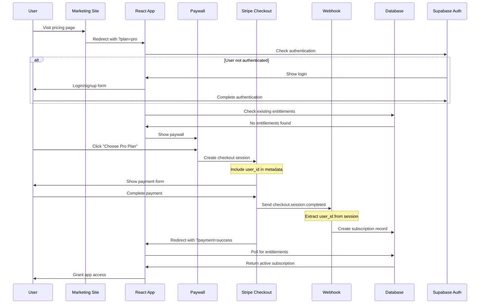
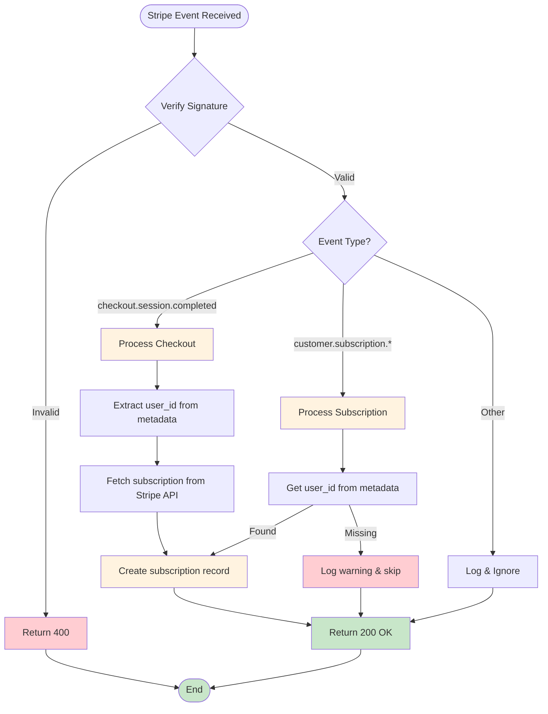
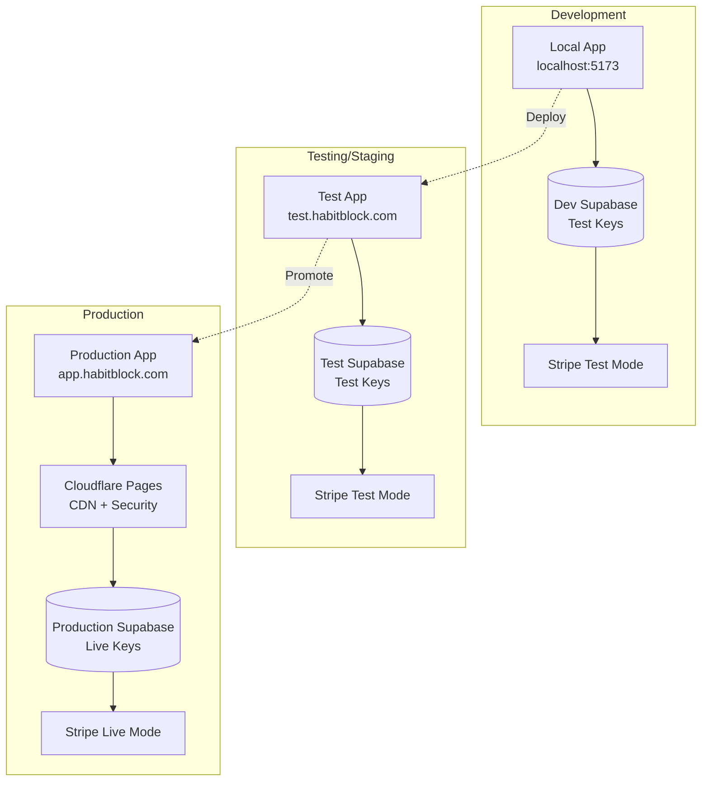

# Complete Payment System Documentation
## From Debugging to Production Deployment

---

## Table of Contents
1. [System Overview](#system-overview)
2. [Architecture & Flow Diagrams](#architecture--flow-diagrams)
3. [Root Cause Analysis: What Was The Issue?](#root-cause-analysis-what-was-the-issue)
4. [Issues Encountered & Solutions](#issues-encountered--solutions)
5. [File Updates for Environment Promotion](#file-updates-for-environment-promotion)
6. [Cloudflare Deployment Guide](#cloudflare-deployment-guide)
7. [Operations Guide: Dev to Prod](#operations-guide-dev-to-prod)

---

## System Overview

We successfully built and debugged a complete **Stripe-integrated payment system** for a habit-tracking SaaS application. The system handles:
- User plan selection from marketing site
- Secure payment processing via Stripe
- Automated subscription provisioning via webhooks  
- Real-time access control based on entitlements

**Key Achievement:** Fixed critical webhook processing issue where payments succeeded but users didn't gain app access.

---

## Architecture & Flow Diagrams

### System Architecture


### Payment Flow


### Webhook Processing Flow


---

## Root Cause Analysis: What Was The Issue?

### The Problem
After completing Stripe payment, users were redirected back to the subscription/paywall page instead of gaining app access, with constant refreshing and polling logs showing null subscription/entitlements.

### Investigation Process
1. **Verified Stripe integration** - Payments were completing successfully
2. **Checked webhook status** - Stripe dashboard showed 100% webhook failure (500 errors)
3. **Enhanced logging** - Added comprehensive webhook and frontend logging
4. **Identified root causes** - Multiple layered issues

### Core Issue: Event Processing Order & Metadata Loss
1. **Stripe sends events in this order:**
   - `checkout.session.completed` ✅ (contains `user_id` in metadata)  
   - `customer.subscription.created` ❌ (missing `user_id` in metadata)

2. **Our original webhook logic:**
   - **IGNORED** `checkout.session.completed` 
   - **PROCESSED** `customer.subscription.created` (no user_id = no record created)

3. **Result:** 
   - Webhook returned 200 ✅ (didn't crash)
   - No subscription record created ❌ (missing user_id)
   - User stuck polling for non-existent entitlements ❌

### The Fix
Process `checkout.session.completed` as the **primary event handler** since it's guaranteed to contain user_id metadata from the frontend. Use subscription events only as fallback handlers.

**Key Insight:** Stripe checkout sessions preserve all metadata from the frontend, while subscription objects may not inherit that metadata. The session is the **authoritative source** for user context.

---

## Issues Encountered & Solutions

### Issue #1: Webhook Returning 500 Errors
**Problem:** Stripe dashboard showed 100% webhook failure rate

**Root Cause:** Synchronous error handling in webhook caused crashes when database operations failed

**Solution:** Implemented **fire-and-forget pattern**
```typescript
serve(async (req) => {
  const processWebhook = async () => {
    // Async processing with error catching
  };
  
  processWebhook().catch(err => console.error(err));
  return new Response("ok", { status: 200 }); // Always return 200
});
```

### Issue #2: Invalid API Key Errors
**Problem:** `"message": "Invalid API key"` preventing database access

**Root Cause:** Service role key was outdated/incorrect

**Solution:** 
1. Retrieved correct service role key from Supabase dashboard
2. Set custom environment variable: `npx supabase secrets set SERVICE_ROLE_KEY=correct-key`
3. Updated webhook: `const serviceRoleKey = Deno.env.get("SERVICE_ROLE_KEY") || Deno.env.get("SUPABASE_SERVICE_ROLE_KEY")!;`

### Issue #3: Row Level Security (RLS) Blocking Inserts
**Problem:** `"new row violates row-level security policy for table 'subscriptions'"`

**Root Cause:** Webhook trying to use anon key (subject to RLS) instead of service role key

**Solution:** Ensured webhook uses service role key which bypasses RLS policies

### Issue #4: Missing user_id in Subscription Events
**Problem:** Webhook processed events but couldn't create records due to missing user_id

**Root Cause:** `customer.subscription.*` events don't reliably contain user_id metadata

**Solution:** Process `checkout.session.completed` events as primary handler
```typescript
if (event.type === 'checkout.session.completed') {
  const session = event.data.object as Stripe.Checkout.Session;
  const userId = session.metadata?.user_id; // Always present!
  const subscriptionId = session.subscription as string;
  
  const subscription = await stripe.subscriptions.retrieve(subscriptionId);
  await upsertSubscription({...});
}
```

### Issue #5: Edge Function Authentication Issues
**Problem:** Webhooks blocked with 401 Unauthorized

**Root Cause:** JWT verification enabled by default

**Solution:** Disabled JWT verification in `supabase/config.toml`
```toml
[functions.stripe-webhook]
verify_jwt = false
```

### Issue #6: Deno Compatibility Issues
**Problem:** `Buffer is not defined` and crypto API failures

**Root Cause:** Deno runtime differences from Node.js

**Solution:**
```typescript
// Before: Node.js style
event = stripe.webhooks.constructEvent(Buffer.from(raw), sig, webhookSecret);

// After: Deno compatible  
event = await stripe.webhooks.constructEventAsync(new Uint8Array(raw), sig, webhookSecret);
```

### Issue #7: Frontend Polling Inefficiency
**Problem:** App polled indefinitely with no timeout

**Root Cause:** No failure conditions or retry limits

**Solution:** Intelligent polling with timeout
```typescript
useEffect(() => {
  let pollCount = 0;
  const maxPolls = 15;
  
  const interval = setInterval(async () => {
    if (pollCount >= maxPolls) {
      clearInterval(interval);
      return;
    }
    pollCount++;
    await fetchEntitlements();
  }, 2000);
}, []);
```

---

## File Updates for Environment Promotion

### Files That MUST Change for Each Environment

#### 1. Environment Configuration Files
```bash
# Create separate env files
.env.development       # Local dev
.env.testing          # Testing environment  
.env.production       # Production environment
```

**Example configurations:**
```typescript
// .env.development
VITE_SUPABASE_URL=https://qnkeqmisuynxchlkckvs.supabase.co
VITE_SUPABASE_ANON_KEY=eyJhbGciOiJIUzI1NiIs... (DEV KEY)
VITE_STRIPE_PUBLISHABLE_KEY=pk_test_51... (TEST KEY)
VITE_SITE_URL=http://localhost:5173

// .env.production
VITE_SUPABASE_URL=https://[prod-project-id].supabase.co  
VITE_SUPABASE_ANON_KEY=eyJhbGciOiJIUzI1NiIs... (PROD KEY)
VITE_STRIPE_PUBLISHABLE_KEY=pk_live_51... (LIVE KEY)
VITE_SITE_URL=https://app.habitblock.com
```

#### 2. Backend Environment (Supabase Secrets)
```bash
# Update these secrets in each Supabase project
npx supabase secrets set SERVICE_ROLE_KEY=[env-specific-key]
npx supabase secrets set STRIPE_SECRET_KEY=[env-specific-key]  
npx supabase secrets set STRIPE_WEBHOOK_SECRET=[env-specific-secret]
npx supabase secrets set SITE_URL=[env-specific-url]
```

#### 3. Price Configuration
```typescript
// src/lib/stripe.ts or src/config/pricing.ts
const PRICE_CONFIG = {
  development: {
    pro: 'price_1S6ApKA34RVghX8xdm7fWO9O',    // Test price
    plus: 'price_1S6AqCA34RVghX8xnE0e3E7p'    // Test price
  },
  production: {
    pro: 'price_1LIVE_pro_id',                  // Live price
    plus: 'price_1LIVE_plus_id'                 // Live price
  }
};
```

#### 4. Marketing Site URLs
```html
<!-- website/pricing.html -->
<!-- Development -->
<a href="http://localhost:5173?plan=pro">Choose Pro Plan</a>

<!-- Production -->
<a href="https://app.habitblock.com?plan=pro">Choose Pro Plan</a>
```

#### 5. Database Plans Data
```sql
-- prod-plans.sql
INSERT INTO public.plans VALUES  
  ('price_1LIVE_pro_id','pro','Habit Pro',5,true,false,false,false),
  ('price_1LIVE_plus_id','plus','Habit Plus',null,true,true,true,true);
```

### Files That DON'T Change
- `supabase/functions/stripe-webhook/index.ts` (core logic)
- `src/components/Paywall.tsx` (UI components)
- `src/hooks/useEntitlements.ts` (data fetching logic)
- `supabase/config.toml` (function configuration)

---

## Cloudflare Deployment Guide

### 1. Cloudflare Pages Setup
```bash
# 1. Connect GitHub repository to Cloudflare Pages
# Go to: https://dash.cloudflare.com/pages
# Click "Create a project" → "Connect to Git"
# Select repository: Planner_App_v3
```

### 2. Build Configuration
```yaml
Framework preset: Vite
Build command: npm run build
Build output directory: dist
Root directory: / (leave empty)
Node.js version: 18 or 20
```

### 3. Production Environment Variables in Cloudflare
```bash
VITE_SUPABASE_URL=https://[prod-project-id].supabase.co
VITE_SUPABASE_ANON_KEY=eyJhbGciOiJIUzI1NiIs... (PRODUCTION ANON KEY)
VITE_STRIPE_PUBLISHABLE_KEY=pk_live_51... (LIVE PUBLISHABLE KEY)
VITE_SITE_URL=https://your-domain.com
NODE_VERSION=18
```

### 4. Production Supabase Setup
```bash
# 1. Create new project: "habit-tracker-production"
# 2. Run production migrations:
psql -h [prod-db-host] -U postgres -d postgres -f complete-setup.sql
psql -h [prod-db-host] -U postgres -d postgres -f production-webhook-setup.sql

# 3. Set production secrets:
npx supabase secrets set STRIPE_SECRET_KEY=sk_live_51... --project-ref [prod-project-id]
npx supabase secrets set STRIPE_WEBHOOK_SECRET=whsec_[prod-secret] --project-ref [prod-project-id]
npx supabase secrets set SERVICE_ROLE_KEY=[prod-service-role-key] --project-ref [prod-project-id]
npx supabase secrets set SITE_URL=https://your-domain.com --project-ref [prod-project-id]

# 4. Deploy production functions:
npx supabase functions deploy stripe-webhook --project-ref [prod-project-id]
```

### 5. Production Stripe Configuration
```bash
# Create Live Webhook in Stripe Dashboard:
# URL: https://[prod-project-id].supabase.co/functions/v1/stripe-webhook
# Events: checkout.session.completed, customer.subscription.*

# Create Live Products with LIVE price IDs
# Insert into database:
INSERT INTO public.plans VALUES
  ('price_1LIVE_PRO_ID','pro','Habit Pro',5,true,false,false,false),
  ('price_1LIVE_PLUS_ID','plus','Habit Plus',null,true,true,true,true);
```

### 6. Custom Domain Setup
```bash
# In Cloudflare Pages:
# 1. Go to Custom domains → "Set up a custom domain"
# 2. Enter: app.habitblock.com
# 3. Add CNAME record: app → your-project.pages.dev
```

### 7. Security Configuration
```bash
# Create public/_headers file:
/*
  X-Frame-Options: DENY
  X-Content-Type-Options: nosniff
  Referrer-Policy: strict-origin-when-cross-origin

# Create public/_redirects file (for SPA routing):
/*    /index.html   200
```

---

## Operations Guide: Dev to Prod

### Complete Development to Production Operations Manual

#### Environment Architecture


#### Database Schema (Production)
```sql
-- Core tables
CREATE TABLE public.subscriptions (
  id UUID PRIMARY KEY DEFAULT gen_random_uuid(),
  user_id UUID NOT NULL REFERENCES auth.users(id) ON DELETE CASCADE,
  stripe_customer_id TEXT NOT NULL,
  stripe_subscription_id TEXT NOT NULL,
  price_id TEXT NOT NULL,
  status TEXT NOT NULL,
  current_period_end TIMESTAMPTZ NOT NULL,
  created_at TIMESTAMPTZ NOT NULL DEFAULT now()
);

CREATE TABLE public.plans (
  price_id TEXT PRIMARY KEY,
  code TEXT NOT NULL,
  name TEXT NOT NULL,
  max_objectives INT,
  has_advanced_analytics BOOLEAN NOT NULL DEFAULT FALSE,
  can_copy_weeks BOOLEAN NOT NULL DEFAULT FALSE,
  can_export_json BOOLEAN NOT NULL DEFAULT FALSE,
  priority_support BOOLEAN NOT NULL DEFAULT FALSE
);

-- Monitoring table
CREATE TABLE public.webhook_events (
  id UUID PRIMARY KEY DEFAULT gen_random_uuid(),
  stripe_event_id TEXT NOT NULL UNIQUE,
  event_type TEXT NOT NULL,
  processed_at TIMESTAMPTZ NOT NULL DEFAULT NOW(),
  processing_duration_ms INTEGER,
  user_id UUID REFERENCES auth.users(id),
  success BOOLEAN NOT NULL DEFAULT TRUE,
  error_message TEXT,
  created_at TIMESTAMPTZ NOT NULL DEFAULT NOW()
);

-- Performance indexes
CREATE INDEX CONCURRENTLY subscriptions_user_id_idx ON public.subscriptions(user_id);
CREATE INDEX CONCURRENTLY subscriptions_stripe_id_idx ON public.subscriptions(stripe_subscription_id);
CREATE INDEX CONCURRENTLY webhook_events_stripe_id_idx ON public.webhook_events(stripe_event_id);
```

#### Key Management Strategy
```env
# Development
STRIPE_SECRET_KEY=sk_test_51... (Test)
STRIPE_PUBLISHABLE_KEY=pk_test_... (Test)
SUPABASE_SERVICE_ROLE_KEY=[dev-service-key]

# Production  
STRIPE_SECRET_KEY=sk_live_51... (Live)
STRIPE_PUBLISHABLE_KEY=pk_live_... (Live)
SUPABASE_SERVICE_ROLE_KEY=[prod-service-key]

# NEVER MIX ENVIRONMENTS
```

#### Deployment Checklist

**Pre-Deployment:**
- [ ] All tests passing in development
- [ ] Database migrations ready
- [ ] Environment variables updated
- [ ] Webhook endpoints configured
- [ ] Live Stripe products created
- [ ] Price IDs updated in code
- [ ] Monitoring alerts configured

**Deployment Steps:**
1. [ ] Create production Supabase project
2. [ ] Deploy database migrations
3. [ ] Set production environment variables
4. [ ] Deploy Edge Functions
5. [ ] Configure Cloudflare Pages
6. [ ] Set up custom domain
7. [ ] Update marketing site URLs
8. [ ] Create live Stripe webhook
9. [ ] Test payment flow end-to-end
10. [ ] Monitor webhook success rate

**Post-Deployment:**
- [ ] Verify webhook connectivity (>99% success rate)
- [ ] Test small live transaction
- [ ] Monitor subscription creation rate
- [ ] Check user access flow
- [ ] Verify error handling
- [ ] Update documentation

#### Monitoring & Alerting
```sql
-- Key monitoring queries
-- Failed webhooks in last 24 hours
SELECT * FROM public.webhook_events 
WHERE success = FALSE 
AND created_at > NOW() - INTERVAL '24 hours';

-- Subscription creation rate
SELECT 
  DATE(created_at) as date,
  COUNT(*) as subscriptions_created
FROM public.subscriptions 
WHERE created_at > NOW() - INTERVAL '7 days'
GROUP BY DATE(created_at);

-- Webhook processing times
SELECT 
  event_type,
  AVG(processing_duration_ms) as avg_duration,
  MAX(processing_duration_ms) as max_duration
FROM public.webhook_events 
WHERE created_at > NOW() - INTERVAL '24 hours'
GROUP BY event_type;
```

#### Emergency Procedures
```bash
# Webhook Rollback
git checkout [previous-working-commit] -- supabase/functions/stripe-webhook/
npx supabase functions deploy stripe-webhook --project-ref [prod-project-id]

# Emergency Subscription Creation (if webhook fails)
INSERT INTO public.subscriptions (user_id, stripe_customer_id, stripe_subscription_id, price_id, status, current_period_end)
VALUES ('[user-id]', '[customer-id]', '[subscription-id]', '[price-id]', 'active', NOW() + INTERVAL '1 year');

# Database Rollback
psql -f migrations/rollback_[version].sql
```

---

## Key Lessons Learned

### 1. Event Processing Architecture
**Always process checkout completion events first** - they contain the most reliable user context.

### 2. Fire-and-Forget Pattern  
**Webhooks should always return success immediately** to prevent retries and cascade failures.

### 3. Environment Segregation
**Strict separation between development, testing, and production** environments prevents configuration errors.

### 4. Service vs Anon Keys
**Use service role keys for webhooks** (bypass RLS) and **anon keys for frontend** (respect RLS).

### 5. Comprehensive Logging
**Detailed logging is essential** for debugging payment systems in production.

### 6. Testing Infrastructure
**Build debugging tools early** - they're invaluable when issues arise in production.

---

## Current System Status

✅ **Payment System:** Fully operational end-to-end
✅ **Webhook Processing:** Fixed and handling events correctly  
✅ **Database Operations:** Working with proper permissions
✅ **Frontend Integration:** Seamless user experience
✅ **Error Handling:** Robust with comprehensive logging
✅ **Documentation:** Complete for future maintenance

**Next Steps:** Deploy to production following the Cloudflare deployment guide above.

---

## Missing Information Added: Comprehensive Development to Production Operations Guide

### Price & Product Management

#### Adding New Products
**Step 1: Create in Stripe Dashboard**
```bash
# 1. Create Product in Stripe Dashboard
# 2. Create Price for Product  
# 3. Note the price_id (price_1XXXXX...)
```

**Step 2: Add to Database**
```sql
INSERT INTO public.plans (price_id, code, name, max_objectives, has_advanced_analytics, can_copy_weeks, can_export_json, priority_support)
VALUES 
  ('price_1NewProduct123', 'premium', 'Habit Premium', 20, true, true, true, true);
```

**Step 3: Update Frontend**
```typescript
const PRICE_MAPPING = {
  pro: 'price_1XXXXX_pro',
  plus: 'price_1XXXXX_plus', 
  premium: 'price_1NewProduct123' // New product
};
```

#### Rolling Out New Price IDs
**For Existing Customers (Grandfathering)**
```sql
-- Keep old prices in database
-- Create new prices for new customers
INSERT INTO public.plans (price_id, code, name, max_objectives, has_advanced_analytics, can_copy_weeks, can_export_json, priority_support)
VALUES 
  ('price_1NewPrice456', 'pro', 'Habit Pro (New)', 5, true, false, false, false);
```

### Database Migration Strategy

#### Migration File Structure
```
migrations/
├── 001_initial_schema.sql
├── 002_add_plans_table.sql
├── 003_add_webhook_monitoring.sql
├── 004_add_indexes.sql
└── 005_add_new_product_fields.sql
```

#### Production Migration Process
```bash
# 1. Backup database
pg_dump -h [prod-db-host] -U postgres -d postgres > backup_$(date +%Y%m%d).sql

# 2. Run migration during low traffic
psql -h [prod-db-host] -U postgres -d postgres -f migration_005.sql

# 3. Verify migration success
psql -h [prod-db-host] -U postgres -d postgres -c "SELECT * FROM new_table LIMIT 5;"

# 4. Monitor for issues
# 5. Rollback if needed
psql -h [prod-db-host] -U postgres -d postgres -f rollback_005.sql
```

### Security Model & Key Management

#### Key Types & Rotation Strategy
```env
# Test Keys (Development/Testing)
STRIPE_SECRET_KEY=sk_test_51...
STRIPE_PUBLISHABLE_KEY=pk_test_...

# Live Keys (Production)  
STRIPE_SECRET_KEY=sk_live_51...
STRIPE_PUBLISHABLE_KEY=pk_live_...

# Webhook Secrets (Different per environment)
DEV_WEBHOOK_SECRET=whsec_dev123...
PROD_WEBHOOK_SECRET=whsec_prod789...
```

#### Key Rotation Process
```bash
# 1. Generate new service role key in Supabase Dashboard
# 2. Update webhook environment variables:
npx supabase secrets set SERVICE_ROLE_KEY=new_key --project-ref [project-id]
# 3. Deploy updated functions
npx supabase functions deploy stripe-webhook --project-ref [project-id]
# 4. Verify webhooks working
# 5. Revoke old key
```

### Advanced Monitoring & Observability

#### Production Monitoring Tables
```sql
-- Detailed webhook monitoring
CREATE TABLE IF NOT EXISTS public.webhook_events (
  id UUID PRIMARY KEY DEFAULT gen_random_uuid(),
  stripe_event_id TEXT NOT NULL UNIQUE,
  event_type TEXT NOT NULL,
  processed_at TIMESTAMPTZ NOT NULL DEFAULT NOW(),
  processing_duration_ms INTEGER,
  user_id UUID REFERENCES auth.users(id),
  subscription_id TEXT,
  customer_id TEXT,
  success BOOLEAN NOT NULL DEFAULT TRUE,
  error_message TEXT,
  retry_count INTEGER DEFAULT 0,
  created_at TIMESTAMPTZ NOT NULL DEFAULT NOW()
);

-- Performance indexes
CREATE INDEX CONCURRENTLY webhook_events_created_idx ON public.webhook_events(created_at);
CREATE INDEX CONCURRENTLY webhook_events_success_idx ON public.webhook_events(success);
CREATE INDEX CONCURRENTLY webhook_events_type_idx ON public.webhook_events(event_type);
```

#### Advanced Monitoring Queries
```sql
-- Webhook failure rate by hour
SELECT 
  DATE_TRUNC('hour', created_at) as hour,
  COUNT(*) as total_events,
  COUNT(*) FILTER (WHERE success = false) as failures,
  (COUNT(*) FILTER (WHERE success = false)::float / COUNT(*) * 100) as failure_rate_percent
FROM public.webhook_events 
WHERE created_at > NOW() - INTERVAL '24 hours'
GROUP BY DATE_TRUNC('hour', created_at)
ORDER BY hour;

-- Revenue impact analysis
SELECT 
  DATE(s.created_at) as date,
  COUNT(*) as subscriptions_created,
  COUNT(*) * 99 as estimated_revenue_gbp -- Assuming £99 average
FROM public.subscriptions s
WHERE s.created_at > NOW() - INTERVAL '30 days'
GROUP BY DATE(s.created_at)
ORDER BY date;

-- User conversion funnel
WITH checkout_sessions AS (
  SELECT DATE(created_at) as date, COUNT(*) as checkouts_started
  FROM webhook_events 
  WHERE event_type = 'checkout.session.completed'
  AND created_at > NOW() - INTERVAL '7 days'
  GROUP BY DATE(created_at)
),
subscriptions AS (
  SELECT DATE(created_at) as date, COUNT(*) as subscriptions_created
  FROM subscriptions
  WHERE created_at > NOW() - INTERVAL '7 days'
  GROUP BY DATE(created_at)
)
SELECT 
  c.date,
  c.checkouts_started,
  COALESCE(s.subscriptions_created, 0) as subscriptions_created,
  CASE 
    WHEN c.checkouts_started > 0 
    THEN (COALESCE(s.subscriptions_created, 0)::float / c.checkouts_started * 100)
    ELSE 0 
  END as conversion_rate_percent
FROM checkout_sessions c
LEFT JOIN subscriptions s ON c.date = s.date
ORDER BY c.date;
```

### Emergency Response Procedures

#### Webhook Complete Failure Scenario
```bash
# 1. Immediate Response (Stop revenue loss)
# Temporarily direct users to manual subscription signup
# Or create subscriptions manually for recent payments

# 2. Identify Issue  
curl https://[project-id].supabase.co/functions/v1/debug-env

# 3. Quick Fix Options
# Option A: Rollback to previous working version
git checkout [last-working-commit] -- supabase/functions/stripe-webhook/
npx supabase functions deploy stripe-webhook --project-ref [project-id]

# Option B: Emergency manual subscription creation
# Get recent successful payments from Stripe Dashboard
# Create subscription records manually:
INSERT INTO public.subscriptions (user_id, stripe_customer_id, stripe_subscription_id, price_id, status, current_period_end)
SELECT 
  '[user-id-from-metadata]',
  '[customer-id-from-stripe]', 
  '[subscription-id-from-stripe]',
  '[price-id-from-stripe]',
  'active',
  NOW() + INTERVAL '1 year';
```

#### Database Corruption Recovery
```bash
# 1. Stop all webhook processing
# Update webhook to return 200 but skip processing

# 2. Restore from backup  
pg_restore --clean --if-exists -h [host] -U postgres -d postgres backup_latest.sql

# 3. Replay missed webhook events
# Get events from Stripe API for time period
# Process manually or via script

# 4. Verify data integrity
SELECT COUNT(*) FROM subscriptions WHERE created_at > '[incident-time]';
SELECT COUNT(*) FROM webhook_events WHERE created_at > '[incident-time]' AND success = true;
```

### Performance Optimization

#### Database Performance
```sql
-- Add missing indexes for production load
CREATE INDEX CONCURRENTLY subscriptions_status_idx ON public.subscriptions(status);
CREATE INDEX CONCURRENTLY subscriptions_period_end_idx ON public.subscriptions(current_period_end);
CREATE INDEX CONCURRENTLY plans_code_idx ON public.plans(code);

-- Optimize entitlements view with materialized view for high load
CREATE MATERIALIZED VIEW public.user_entitlements_fast AS
SELECT
  s.user_id,
  s.price_id,
  p.code AS plan_code,
  p.name AS plan_name,
  p.max_objectives,
  p.has_advanced_analytics,
  p.can_copy_weeks,
  p.can_export_json, 
  p.priority_support,
  s.status,
  s.current_period_end
FROM public.subscriptions s
JOIN public.plans p ON p.price_id = s.price_id
WHERE s.status IN ('active','trialing') AND s.current_period_end > now();

-- Refresh materialized view (run via cron)
REFRESH MATERIALIZED VIEW public.user_entitlements_fast;
```

#### Frontend Performance
```typescript
// Implement caching for entitlements
const useEntitlementsWithCache = (userId: string) => {
  const [entitlements, setEntitlements] = useState(null);
  const [lastFetch, setLastFetch] = useState(0);
  const CACHE_DURATION = 5 * 60 * 1000; // 5 minutes

  useEffect(() => {
    const now = Date.now();
    if (now - lastFetch < CACHE_DURATION && entitlements) {
      return; // Use cached data
    }

    fetchEntitlements(userId).then(data => {
      setEntitlements(data);
      setLastFetch(now);
    });
  }, [userId]);

  return entitlements;
};
```

---

*This documentation represents the complete journey from a broken payment system to a production-ready solution, including all debugging steps, architectural decisions, operational procedures, and advanced production management strategies.*